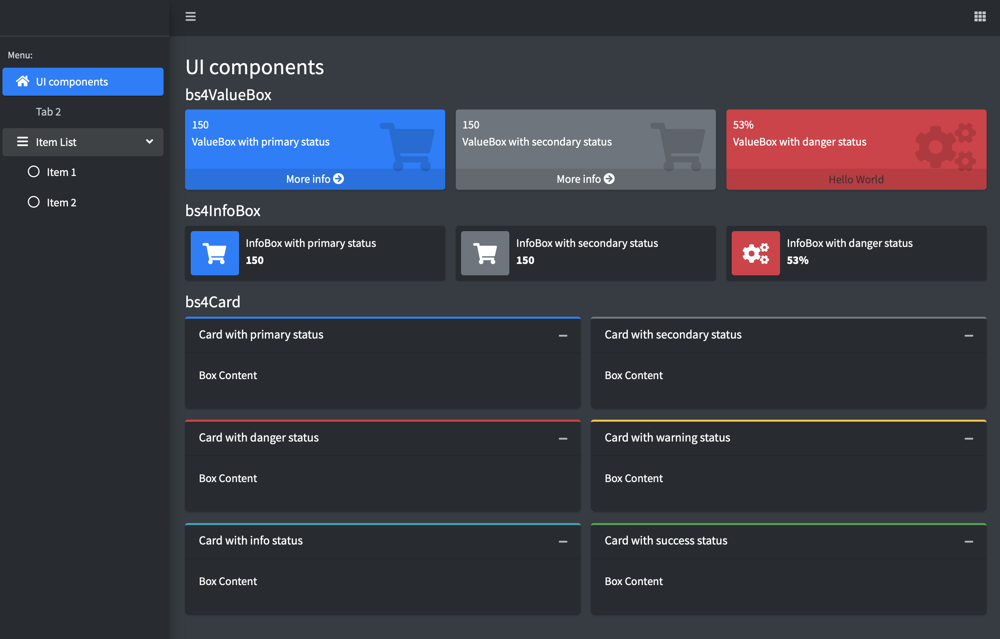
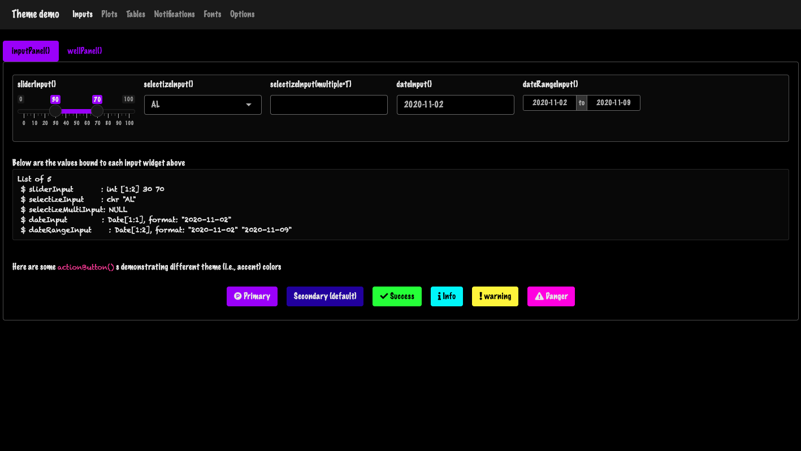
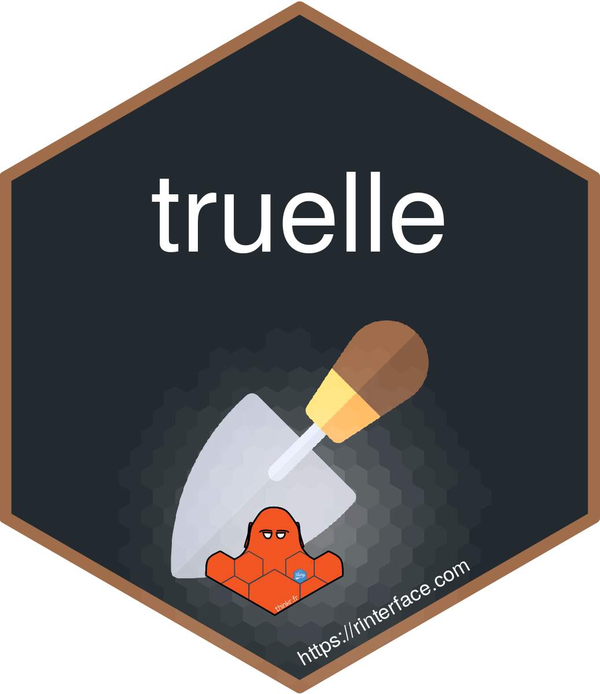

class: inverse, center, title-slide, middle


# Outstanding User Interfaces with Shiny

## David Granjon

### `r Sys.Date()`
### R in Pharma 2020

```{r setup, include=FALSE}
library(emo)
library(shiny)
library(countdown)
library(sass)
options(htmltools.dir.version = FALSE)
knitr::opts_chunk$set(
  fig.width = 10, fig.height = 6, fig.retina = 2,
  warning = FALSE, message = FALSE
)

#xaringanExtra::use_search(show_icon = TRUE)
xaringanExtra::use_tile_view()
xaringanExtra::use_share_again()
xaringanExtra::use_clipboard()
xaringanExtra::use_tachyons()
xaringanExtra::use_fit_screen()
xaringanExtra::use_panelset()

xaringanExtra::use_extra_styles(
  hover_code_line = TRUE,         #<<
  mute_unhighlighted_code = TRUE  #<<
)
#source("assets/R/utils.R")
```

```{r js4shiny, echo=FALSE}
js4shiny::html_setup(stylize = c("fonts", "variables", "code"))
```

---

# Hi there `r ji("pizza")`

We're in for 20 minutes of **fun**!

- Grab a `r ji("coffee")`
- Make yourself comfortable `r ji("couch")` or 🧘
- Ask questions `r ji("question")` 

.flex.tc[
.w-30.mr3.center[

<br>
.f5[David]

.small[Senior Expert Data Scientist, Novartis]
]
]

---

# Program

.panelset[
.panel[.panel-name[🎨 Part 1]
Tweaks apps style with CSS and Sass

Learning objectives:
- Discover `{truelle}`.
- CSS basics.
- How Sass may help you.
- High level CSS and Sass tools: `{bslib}` and `{fresh}`.
]

.panel[.panel-name[💃 Part 2]
Unleash app interactivity with JavaScript

Learning objectives:
- Discover how Shiny deals with inputs.
- Custom handle example.
- Add React and any JS framework: `{reactR}` and `{packer}`

]

.panel[.panel-name[🧙‍♀️ Part 3]
Be a warrior: new template from scratch

Learning objectives:
- Discover `{charpente}`. 
- ...

]

]

---
class: inverse center title-slide middle
# Introduction


---
class: header_background 
# Shiny

<br/>

.center[

]

- `{Shiny}` is about 10 years old! 
- Today, many tools can make your apps shining.
- Let's review some of them ...


---
class: inverse center title-slide middle
# 🎨 Tweaks apps style with CSS and Sass 🎨


---
class: header_background 
# From the simplest app ... 👶

<br>

.center[
```{r, eval=TRUE, echo=FALSE}
knitr::include_app("https://gallery.shinyapps.io/084-single-file", height = "400px")
```
]


---
class: header_background 
# Is this a Shiny app ❓

<br>

.center[
<iframe width="50%" src="https://unleash-shiny.shinyapps.io/intro_dj-system/" allowfullscreen="" frameborder="0" scrolling="yes" height="400px"></iframe>
]


---
class: header_background
# What's the difference ❓

<br>

- __111__ lines of CSS.
- 29 lines of JavaScript code.
- 2 png images (dj gear + rotating wheel).
- 36 lines of R code (`{wavesurfer}` htmlWidget).
- Few custom HTML tags.

---
class: header_background
# What is CSS?

<br>

CSS stands for Cascading Style Sheets


.pull-left[
## Apply CSS
```{r, eval=FALSE}
tags$style(
  "p {
    color: red;
   }
  "
)
```
]

.pull-right[
<iframe width="100%" src="https://unleash-shiny.shinyapps.io/css_selector-class-id/" allowfullscreen="" frameborder="0" scrolling="yes" height="400px"></iframe>
]


---
class: header_background
# But CSS becomes messy 🗑

<br>

- Easy to repeat yourself.
- Hard to read.
- ...

.center[
```{r, echo = FALSE, out.width='40%', fig.align='center'}
knitr::include_graphics("assets/images/alors_heureux.gif")
```
]

---
class: header_background
# Tidy your CSS with Sass 🧹

<br>

- Sass = Syntactically Awesome Style Sheets.
- Programmable: variables, functions, loops, operators, modules, ...
- An R interface exists: `{sass}`.

.center[

]

---
class: header_background
# {sass} in action

<br>

.panelset[
.panel[.panel-name[Variables]
.small.pull-left[
```{r, eval=FALSE}
rule1 <- ".class-1{ color: $color; }"
rule2 <- ".class-2{ background-color: $color; }"
sass(input = list(color = "purple", rule1, rule2))
```
]

.pull-right[
```
#> /* CSS */
#> .class-1 {
#>   color: purple;
#> }
#> 
#> .class-2 {
#>   background-color: purple;
#> }
```
]
]

.panel[.panel-name[Functions]

.small.pull-left[
```{r, eval=FALSE}
sass(
  list(
    a = 2,
    b = 4,
    "@function multiply($parm1, $parm2) {
      @debug 'parm1 is #{$parm1}';
      @debug 'parm2 is #{$parm2}';

      @return $parm1 * $parm2;
    }",
    ".my-class {
      width: multiply($a, $b) * 1px;
    }"
  )
)
```
]

.pull-right[
```
stdin:4 DEBUG: parm1 is 2
stdin:5 DEBUG: parm2 is 4
#> /* CSS */
#> .my-class {
#>   width: 8px;
#> }
```
]

]

.panel[.panel-name[With Shiny]

.xsmall.pull-left[
```{r, eval=FALSE}
css <- sass(
  sass_layer(
    defaults = list(
      turquoise = "#03a4ff",
      cyan = "#e705be",
      green = "#f3d6e9",
      yellow = "#fdaf2c",
      red = "#ff483e",
      "scheme-main" = "hsl(0, 0%, 10%)"
    ),
    rules = sass_file(
      input = system.file(
        "sass/bulma/bulma.sass",
        package = "OSUICode"
      )
    )
  )
)
```
]

.pull-right[
<iframe width="100%" src="https://unleash-shiny.shinyapps.io/sass_examples_shinybulma-custom" allowfullscreen="" frameborder="0" scrolling="yes" height="300px"></iframe>
]

]
]

<br>


---
class: header_background
# Isn't there something easier?

<br>

--

.pull-left[
## {fresh}
- Built on top of `{sass}`.
- For `{shiny}`, `{shinydashboard}`, ...
]

.pull-right[
## {bslib}
- Built on top of `{sass}`.
- For `{shiny}`.
- Live theming widget.
- Dynamic theming. 
- Conditional rendering. 
- ...
]

---
class: header_background
# {fresh}

<br>


.xsmall.pull-left[
```{r, eval=FALSE}
library(fresh)
dark_theme <- create_theme(
  bs4dash_vars(
    navbar_light_color = "#bec5cb",
    navbar_light_active_color = "#FFF",
    navbar_light_hover_color = "#FFF"
  ),
  bs4dash_yiq(
    contrasted_threshold = 10, 
    text_dark = "#FFF", 
    text_light = "#272c30"
  ),
  bs4dash_layout(main_bg = "#353c42"),
  bs4dash_sidebar_dark(
    bg = "#272c30", 
    color = "#bec5cb", 
    hover_color = "#FFF",
    submenu_bg = "#272c30", 
    submenu_color = "#FFF", 
    submenu_hover_color = "#FFF"
  ),
  bs4dash_status(dark = "#272c30"),
  bs4dash_color(gray_900 = "#FFF", white = "#272c30")
)
```
]

.pull-right[
```{r, echo = FALSE, out.width='100%', fig.align='center'}

```
]


---
class: header_background
# {bslib}

<br>

.xsmall.pull-left[
```{r, eval=FALSE}
library(bslib)
bslib_neon_theme <- bs_theme(
  version = 4, 
  bg = "#000000",
  fg = "#FFFFFF",
  primary = "#9600FF",
  secondary = "#1900A0",
  success = "#38FF12",
  info = "#00F5FB",
  warning = "#FFF100",
  danger = "#FF00E3",
  base_font = "Marker Felt",
  heading_font = "Marker Felt",
  code_font = "Chalkduster"
)
bs_theme_preview(bslib_neon_theme, with_themer = FALSE)
```
]

.pull-right[
```{r, echo = FALSE, out.width='100%', fig.align='center'}

```
]


---
class: inverse center title-slide middle
# 💃 Unleash app interactivity with JavaScript 💃


---
class: header_background 
# TODO


---
class: inverse center title-slide middle
# 🧙‍♀ Be a wizard: new template from scratch 🧙‍♀


---
class: header_background 
# TODO


<!--

---
class: header_background 
# Welcome {shinyMobile}? 

<br/>
Built on top of the [Framework7](https://framework7.io/) web framework.

.pull-left[
- Native look and feel for iOS and Android
- PWA support.
- ... also works for desktop apps 😏
]

.pull-right[

]


---
class: header_background
# Progressive web apps (PWA)

<br/>
## Take some advantages of both worlds:

  - Can be __installed__ on the device ... 
  - ... But run via a web browser.
  - Provide __offline__ features (don't expect too much).
  - One code base (web languages).

<br/>
--
.center[
`r emo::ji("sad")` Less performance than native. 
]

---
class: center middle
# Your turn `r emo::ji("experiment")`! 

```{r, echo = FALSE, out.width='40%', fig.align='center'}
knitr::include_graphics("assets/images/excited-minions.gif")
```

---
class: header_background
# Production ready app in minutes

##  {truelle} is a {golem} GUI generator `r emo::ji("wizard")`! 

.center[

]


---
class: end_part_1


---
class: header_background
# Slide

```{r, echo = FALSE, out.width='40%', fig.align='center'}
knitr::include_graphics("assets/images/alors_heureux.gif")
```


---
class: end_part_2

-->