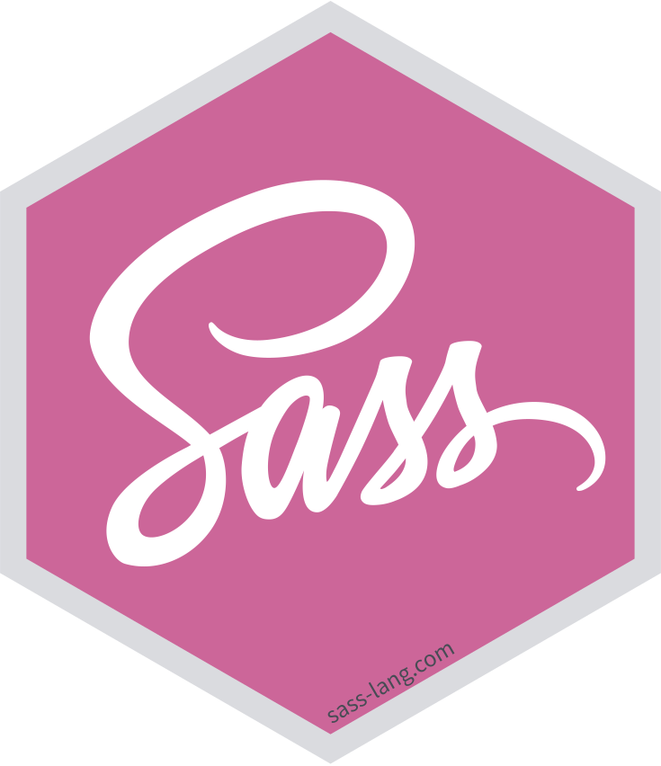
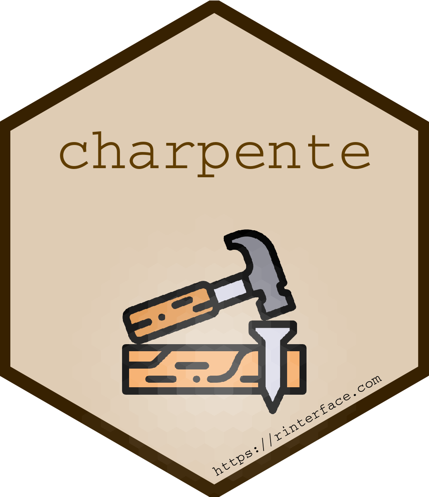
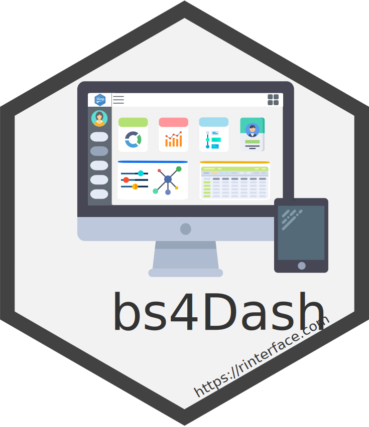

class: inverse, center, title-slide, middle


# Outstanding User Interfaces with Shiny

## David Granjon

### `r Sys.Date()`
### R in Pharma 

```{r setup, include=FALSE}
library(emo)
library(shiny)
library(countdown)
library(sass)
options(htmltools.dir.version = FALSE)
knitr::opts_chunk$set(
  fig.width = 10, fig.height = 6, fig.retina = 2,
  warning = FALSE, message = FALSE
)

#xaringanExtra::use_search(show_icon = TRUE)
xaringanExtra::use_tile_view()
xaringanExtra::use_share_again()
xaringanExtra::use_clipboard()
xaringanExtra::use_tachyons()
xaringanExtra::use_fit_screen()
xaringanExtra::use_panelset()

xaringanExtra::use_extra_styles(
  hover_code_line = TRUE,         #<<
  mute_unhighlighted_code = TRUE  #<<
)
#source("assets/R/utils.R")
```

```{r js4shiny, echo=FALSE}
js4shiny::html_setup(stylize = c("fonts", "variables", "code"))
```

---

# Hi there `r ji("pizza")`

We're in for 20 minutes of **fun**!

- Grab a `r ji("coffee")`
- Make yourself comfortable `r ji("couch")` or 🧘
- Ask questions `r ji("question")` 

.flex.tc[
.w-30.mr3.center[

<br>
.f5[David]

.small[Senior Expert Data Scientist, Novartis]
]
]

---
class: inverse center title-slide middle
# Introduction


---
class: header_background 
# Shiny

<br/>

.center[

]

- `{Shiny}` is about __10__ years old 😲😲😲. 
- Today, many tools can make your apps __shining__.
- Let's review some of them ...


---
class: header_background 
# From the simplest app ... 👶

<br>

.center[
```{r, eval=TRUE, echo=FALSE}
knitr::include_app("http://localhost:3511", height = "400px")
```
]


---
class: header_background 
# Is this a Shiny app ❓

<br>

.center[
<iframe width="50%" src="http://localhost:3512" allowfullscreen="" frameborder="0" scrolling="yes" height="500px" style="margin-top: -50px"></iframe>
]


---
class: header_background
# What's the difference ❓

<br>

- __111__ lines of CSS.

--

- 29 lines of JavaScript code.

--

- 2 png images (dj gear + rotating wheel).

--

- 36 lines of R code (`{wavesurfer}` htmlWidget).

--

- Few custom HTML tags.

---
class: header_background
# What you'll learn today

<br>

.panelset[
.panel[.panel-name[🎨 Part 1]
__Tweak__ apps style with CSS and Sass

- CSS basics.
- How Sass may help you: `{sass}`.
- High level CSS and Sass tools: `{bslib}` and `{fresh}`.
]

.panel[.panel-name[💃 Part 2]
Unleash app __interactivity__ with JavaScript (JS)

- Discover how Shiny deals with inputs.
- Add React and any JS framework with `{packer}`.
- Optimize your app with custom handlers.

]

.panel[.panel-name[🧙‍♀️ Part 3]
Create a new template from scratch

- Discover `{charpente}`. 

]

.panel[.panel-name[🚄 Part 4]
Sorry I don't have time ...

- Discover `{truelle}`.
- Use preexisting templates.
]

]

---
class: center middle

```{r, echo = FALSE, out.width='40%', fig.align='center'}
knitr::include_graphics("assets/images/excited-minions.gif")
```

---
class: inverse center title-slide middle
# 🎨 Tweak with CSS and Sass 🎨


---
class: header_background
# What is CSS?

<br>

CSS stands for Cascading Style Sheets


.pull-left[
## Apply CSS
```{r, eval=FALSE}
tags$style(
  "p {
    color: red;
   }
  "
)
```
]

.pull-right[
<iframe width="100%" src="http://localhost:3513" allowfullscreen="" frameborder="0" scrolling="yes" height="400px"></iframe>
]


---
class: header_background
# But CSS becomes messy 🗑

<br>

- Easy to __repeat__ yourself.
- Difficult to read and maintain. 
- It's a mess ...


```{r, echo = FALSE, out.width='40%', fig.align='center'}
knitr::include_graphics("assets/images/alors_heureux.gif")
```

---
class: header_background
# Tidy your CSS with Sass 🧹

<br>

- Sass = Syntactically Awesome Style Sheets.
- __Programmable__: variables, functions, loops, operators, modules, ...
- Modern web development workflow.
- Will motivate you to learn CSS.

--

.pull-left[
An R interface exists: `{sass}`.

```{r, eval=FALSE}
install.packages("sass")
```
]

.pull-right[

]

---
class: header_background
# {sass} in action

<br>

.panelset[
.panel[.panel-name[Variables]
.small.pull-left[
```{r, eval=FALSE}
library(sass)
rule1 <- ".class-1{ color: $color; }"
rule2 <- ".class-2{ background-color: $color; }"
sass(input = list(color = "purple", rule1, rule2))
```
]

.pull-right[
```
#> /* CSS */
#> .class-1 {
#>   color: purple;
#> }
#> 
#> .class-2 {
#>   background-color: purple;
#> }
```
]
]

.panel[.panel-name[Functions]

.small.pull-left[
```{r, eval=FALSE}
sass(
  list(
    a = 2,
    b = 4,
    "@function multiply($parm1, $parm2) {
      @debug 'parm1 is #{$parm1}';
      @debug 'parm2 is #{$parm2}';

      @return $parm1 * $parm2;
    }",
    ".my-class {
      width: multiply($a, $b) * 1px;
    }"
  )
)
```
]

.pull-right[
```
stdin:4 DEBUG: parm1 is 2
stdin:5 DEBUG: parm2 is 4
#> /* CSS */
#> .my-class {
#>   width: 8px;
#> }
```
]

]

.panel[.panel-name[➿Loops]
.pull-left[
```{r, eval=FALSE}
sass(input = list(
  colors = c("green", "red"),
  "@each $color in $colors {
    .alert-#{$color} {
      color: $color;
    }
  }"
))
```
]

.pull-right[
```
#> .alert-green {
#>   color: green;
#> }
#> 
#> .alert-red {
#>   color: red;
#> }
```
]
]

.panel[.panel-name[With Shiny]

.xsmall.pull-left[
```{r, eval=FALSE}
# CSS to include in your app
css <- sass(
  sass_layer(
    defaults = list(
      turquoise = "#03a4ff",
      cyan = "#e705be",
      green = "#f3d6e9",
      yellow = "#fdaf2c",
      red = "#ff483e",
      "scheme-main" = "hsl(0, 0%, 10%)"
    ),
    rules = sass_file(
      input = system.file(
        "sass/bulma/bulma.sass",
        package = "OSUICode"
      )
    )
  )
)
```
]

.pull-right[
<iframe width="100%" src="http://localhost:3514" allowfullscreen="" frameborder="0" scrolling="yes" height="300px"></iframe>
]

]
]

<br>


---
class: header_background
# Isn't there something easier?

<br>

--

.pull-left[
## {fresh}
- Built on top of `{sass}`.
- For `{shiny}`, `{shinydashboard}`, ...

```{r, eval=FALSE}
install.packages("fresh")
```
]

--

.pull-right[
## {bslib}
- Built on top of `{sass}`.
- For `{shiny}`.
- Live theming widget.
- Dynamic theming. 
- Conditional rendering. 
- ...

```{r, eval=FALSE}
install.packages("bslib")
```
]

---
class: header_background
# A dark theme with {fresh}

<br>


.xsmall.pull-left[
```{r, eval=FALSE}
library(fresh)
dark_theme <- create_theme(
  bs4dash_vars(
    navbar_light_color = "#bec5cb",
    navbar_light_active_color = "#FFF",
    navbar_light_hover_color = "#FFF"
  ),
  bs4dash_yiq(
    contrasted_threshold = 10, 
    text_dark = "#FFF", 
    text_light = "#272c30"
  ),
  bs4dash_layout(main_bg = "#353c42"),
  bs4dash_sidebar_dark(
    bg = "#272c30", 
    color = "#bec5cb", 
    hover_color = "#FFF",
    submenu_bg = "#272c30", 
    submenu_color = "#FFF", 
    submenu_hover_color = "#FFF"
  ),
  bs4dash_status(dark = "#272c30"),
  bs4dash_color(gray_900 = "#FFF", white = "#272c30")
)
```
]

.pull-right[
```{r, echo = FALSE, out.width='100%', fig.align='center'}
knitr::include_graphics("assets/images/bs4Dash-fresh.png")
```
]


---
class: header_background
# A neon theme with {bslib}

<br>

.xsmall.pull-left[
```{r, eval=FALSE}
library(bslib)
bslib_neon_theme <- bs_theme(
  version = 4, 
  bg = "#000000",
  fg = "#FFFFFF",
  primary = "#9600FF",
  secondary = "#1900A0",
  success = "#38FF12",
  info = "#00F5FB",
  warning = "#FFF100",
  danger = "#FF00E3",
  base_font = "Marker Felt",
  heading_font = "Marker Felt",
  code_font = "Chalkduster"
)
bs_theme_preview(bslib_neon_theme, with_themer = FALSE)
```
]

.pull-right[
<iframe width="100%" src="http://localhost:3515" allowfullscreen="" frameborder="0" scrolling="yes" height="400px"></iframe>
]


---
class: header_background
# Dynamic theming example

<br>

Static plot theming requires `{thematic}`

.center[
<iframe width="100%" src="http://localhost:3516" allowfullscreen="" frameborder="0" scrolling="yes" height="400px"></iframe>
]


---
class: header_background
# Conditional rendering

<br>

Only 1 code base, 2 possible outputs 😎️

.pull-left[
## BS4 accordion
<iframe width="100%" src="http://localhost:3517" allowfullscreen="" frameborder="0" scrolling="yes" height="400px"></iframe>
]


.pull-right[
## BS5 accordion
<iframe width="100%" src="http://localhost:3518" allowfullscreen="" frameborder="0" scrolling="yes" height="400px"></iframe>
]


---
class: inverse center title-slide middle
# 💃 Unleash interactivity with JS 💃


---
class: header_background
# CSS does not solve all issues

<br>

- How to add new inputs?

```{r, echo = FALSE, out.width='35%', fig.align='center'}

```

---
class: header_background 
# Add new inputs


---
class: header_background
# Include any web framework

<br>

.panelset[
.panel[.panel-name[📣 Meet `{packer}`]

.small.pull-left[
- A `{usethis}` for JavaScript/R projects.
- Supports Shiny outputs, inputs, htmlwidgets, extensions, ...
- Predefined templates: React, Vue, Framework7.
```{r, eval=FALSE}
install.packages("packer")
remotes::install_github("JohnCoene/packer")
```
]

.pull-right[
<a href="https://github.com/JohnCoene/packer"></a>
]

]

.panel[.panel-name[💥 Scaffold project]
.small.pull-left[
We call:

```r
golem::create_golem(...)
packer::scaffold_golem(framework7 = TRUE)
packer::bundle()
```

- Sets all the necessary structure (npm, loaders, webpack, ...).
- So that you don't have to worry too much.
]

.pull-right[
```{r framework7-assets, echo = FALSE, out.width='75%'}
knitr::include_graphics("assets/images/packer-f7-scaffold.png")
```
]

]

.panel[.panel-name[😄 Enjoy]
.pull-left[
R in Pharm 2021 RinteRface [workshop](https://rinpharma2021.rinterface.com/).
]

.pull-right[
<iframe width="100%" src="http://localhost:3519" allowfullscreen="" frameborder="0" scrolling="yes" height="300px"></iframe>
]
]

]


---
class: header_background
# Optimize: improve user experience

<br>

.panelset[
.panel[.panel-name[`renderUI` causes lags]
.pull-left[
<iframe width="100%" src="http://localhost:3520" allowfullscreen="" frameborder="0" scrolling="yes" height="300px"></iframe>
]

.small.pull-right[
```{r, eval=FALSE}
dummy_task <- reactive({
  Sys.sleep(5)
  12
})

output$custom_box <- renderUI({
  dummy_task() #<<
  box(
    title = "Box",
    width = dummy_task(),
    "Box body",
    background = input$background
  )
})
```
]
]

.panel[.panel-name[Prefer `update_*` functions]

.pull-left[
<iframe width="100%" src="http://localhost:3521" allowfullscreen="" frameborder="0" scrolling="yes" height="300px"></iframe>
]

.xsmall.pull-right[
```{r, eval=FALSE}
dummy_task <- reactive({
  Sys.sleep(5)
  12
})

observeEvent(dummy_task(), {
  updateBox2( #<<
    "mybox",
    action = "update",
    options = list(
      width = dummy_task(),
      title = tagList(
        shinydashboardPlus::dashboardBadge(
          "New",
          color = "red"
        ),
        "New title"
      )
    )
  )
})
```
]

]

]


---
class: inverse center title-slide middle
# 🧙‍♀ New template from scratch 🧙‍♀


---
class: header_background 
# Introducing {charpente}

<br>

.panelset[
.panel[.panel-name[📣 Meet `{charpente}`]
.xsmall.pull-left[
- Plug and play __package__ structure.
- Import dependencies from [jsdelivr](https://www.jsdelivr.com/).
- __Easy__ HTML to R conversion.
- R and JS __boilerplates__: `{shiny}` input bindings, `{shiny}` message handlers, ...
- Seamless JavaScript code management with [esbuild](https://esbuild.github.io/).

```{r, eval=FALSE}
remotes::install_github("RinteRface/charpente")
```

]

.pull-right[
<a href="https://github.com/RinteRface/charpente"></a>
]
]

.panel[.panel-name[👨‍🏭 Workflow example]
.xsmall.pull-left[
```{r, eval=FALSE}
library(charpente)

path <- file.path(tempdir(), "mypkg")
create_charpente(path, license = "mit")

# Once the package is created and opened

# Look for all bulma flavors
get_dependency_versions("bulma")

# Download bulma locally
create_dependency("bulma")

# Create JS handler
create_custom_handler("modal")
# Create input binding
create_input_binding("myinput")
# Compress JS for production
build_js()
devtools::load_all()
```
]

.pull-right[
```{r, echo = FALSE, out.width='75%', fig.align='center'}

```
]

]

.panel[.panel-name[Applications]
.center[
<a href="https://github.com/RinteRface/bs4Dash"></a>
<a href="https://github.com/RinteRface/shinyMobile"></a>
<a href="https://github.com/RinteRface/shinydashboardPlus"></a>
]

]

]


---
class: end_part_1

---
class: inverse center title-slide middle
# 🚄 Sorry I don't have time 🚄


---
class: header_background
# Quickly get started with {truelle} 

<br>

##  {truelle} is a {golem} GUI generator <a href="https://github.com/RinteRface/truelle"></a>

--

.small.pull-left[
```{r, eval=FALSE}
remotes::install_github("RinteRface/truelle")
library(truelle)
run_app()
```
]

.pull-right[
```{r, echo = FALSE, out.width='60%', fig.align='center'}
knitr::include_graphics("assets/images/truelle-ui-template.png")
```
]


---
class: header_background 
# {shinyMobile}

<br>

Built on top of the [Framework7](https://framework7.io/) web framework.

.small.pull-left[
- Native look and feel for iOS and Android
- PWA support:
  - Can be __installed__ on the device ... 
  - ... But run via a web browser.
  - Provide __offline__ features (don't expect too much).
  - One code base (web languages).
- ... also works for desktop apps 😏
]

.pull-right[

]


---
class: center middle
# Want to learn more ❓

.center[
📖 [Read my book](https://unleash-shiny.rinterface.com) 📖
]

```{r, echo = FALSE, out.width='20%', fig.align='center'}

```

.center[
Thanks you 🙇
]

---
class: end_part_2
